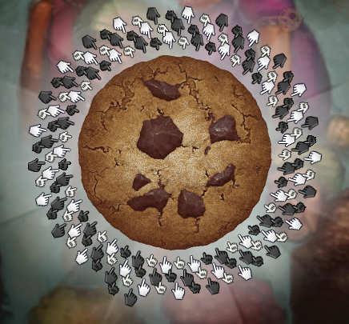

# Instalation
Make sure you are seeing this through my Github Pages instead of the Github repo. Your URL should start with https://sherirk.github.io/.
If not, then [click here](https://sherirk.github.io/CookieClickerProjects/mods).

Once in the correct page, you can copy the link given when clicking in the mod's title. Use this url when loading the mod with your favorite method.

<details><summary>Game's console</summary>
<p>

```
Game.LoadMod('URL of the mod here, keep the quotes');
```

</p>
</details>

<details><summary>Bookmark</summary>
<p>

```
javascript: (function() {
    Game.LoadMod('URL of the mod here, keep the quotes');
}());
```

</p>
</details>

<details><summary>Tampermonkey/Greasemonkey/Violentmonkey script</summary>
<p>

```
// ==UserScript==
// @name Cookie Clicker OC Ideas
// @namespace Cookie Clicker OC Ideas
// @include http://orteil.dashnet.org/cookieclicker/
// @include https://orteil.dashnet.org/cookieclicker/
// @include http://orteil.dashnet.org/cookieclicker/beta/
// @include https://orteil.dashnet.org/cookieclicker/beta/
// @version github-latest
// @grant none
// ==/UserScript==

(function() {
    const checkReady = setInterval(function() {
        if (typeof Game.ready !== 'undefined' && Game.ready) {
            Game.LoadMod('URL of the mod here, keep the quotes');
            clearInterval(checkReady);
        }
    }, 1000);
})();
```

</p>
</details>

<details><summary>CCMM/YACCMM/Cppkies</summary>
<p>

Use the URL you got without any changes.

</p>
</details>

## [allVersionsCookies](allVersionsCookies/main.js) [(Steam)](https://steamcommunity.com/sharedfiles/filedetails/?id=2979394125)
This mod simply makes both Steamed Cookies and Web Cookies appear in the shop. Currently the game has a check when creating the shop so that the other cookie doesn't appear. The `pool`, `price` and `power` properties of the cookies remain intact, so buying the other cookie will give no CPS boost.

## [chipsPerSec](chipsPerSec/main.js)
This is a tiny change to the mod by Quazillionaire that I personally use in my game. Only change is compatibility with my clicksPerSecond mod. The change is so tiny that I don't think it's fair game to upload it to the steam workshop, but I still have it here in case anyone may want it.

## [clicksPerSecond](clicksPerSecond/main.js) [(Steam)](https://steamcommunity.com/sharedfiles/filedetails/?id=2985170770)
Adds a new line under the cookies per second that shows the current clicks per second. I made it by modifying the mod by Xep. It also adds another line that shows the total cookies per second by taking clicks per second into account. Both clicks per second and cookies made by clicks per second are exposed as `Game.trueClicksPs` and `Game.cookiesPsByClicks` respectively.

## [cursors](cursors/main.js) [(Steam)](https://steamcommunity.com/sharedfiles/filedetails/?id=2979037184)
Adds the ability to change the cursors around the big cookie. I made it after seeing that the og game files had the other 3 cursors, as well as what seemed like a try to add them in the code of the game. To get the cursors to look like this though:



We would need to inject code into the function `Game.DrawBackground`, and I don't like to do code injection when possible. Maybe I will make it in the future.

## [FPSGraph](FPSGraph/main.js) [(Steam)](https://steamcommunity.com/sharedfiles/filedetails/?id=2979037404)
This started as a try to have the FPS counter and graph that can be seen in the browser version when entering debugging mode, but without the rest of the debugging tools. I ended up adding the debug timers, as well as adding a button to use the `Game.DebugUpgradeCpS` function, which is the least game changing function of the debug menu. All in all I don't know why it's still called FPSGraph.

## [hooksControl](hooksControl/main.js) [(Steam)](https://steamcommunity.com/sharedfiles/filedetails/?id=2980460504)
Because the steam version uses `promises` and `Promise.all` when loading mods, even though the mods are loaded in the order that you set them to, they don't necessarily finish loading in that order; so sometimes the different functions in the Game's hooks are loaded out of the order that you would expect them to. This mod gives you the option to reorder the functions once they are registered, as well as disabling and enabling them without reloading the game. The mod doesn't save any data about the order of the functions, so you have to reorder them everytime you reload the game. It also has a preview of the function so that you can guess from which mod it is (there is no way to know what mod registered any function). This was my first "complex" mod, and it was done just because some things weren't using a monospace font (spite is a good motivator).

## [moreMonospaceNumbers](moreMonospaceNumbers/main.js)
Just like chipsPerSec, this is a tiny change to an already existing mod that I felt was too tiny to upload. It now checks for a lot of "Cookies Per Time" mods, as well as my clicksPerSecond mod.

## [numberFormatting](numberFormatting/main.js) [(Steam)](https://steamcommunity.com/sharedfiles/filedetails/?id=2979037468)
Changes the `Beautify` function to have support for both [long and short scales](https://en.wikipedia.org/wiki/Long_and_short_scales). It also lets you use shorter words next to your numbers, just like the mobile version, as well as whether you want a decimal dot or comma.
I also tried to make it `Beautify` the upgrades and achievements name and descriptions, and while it works, many numbers are hardcoded in the text.

## [steamAchievementBlocker](steamAchievementBlocker/main.js) [(Steam)](https://steamcommunity.com/sharedfiles/filedetails/?id=2979037504)
My first ever mod! Also the first ever time I used javascript. This mod is extremely unnecesary and simple, and was made just as test/practice. Pls don't use it? You can load any of the sample mods that come with the steam version and you will get the same result.
