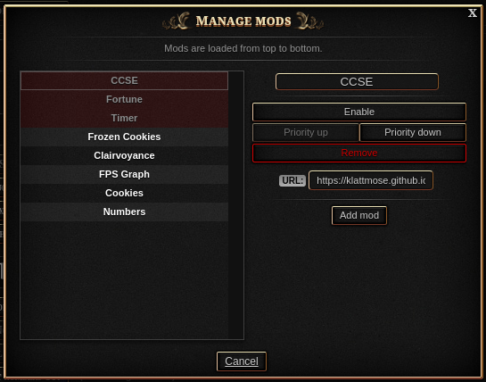
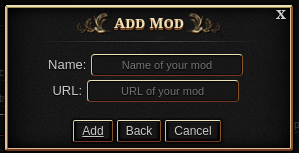
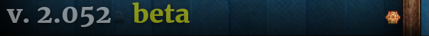

# Yet Another Cookie Clicker Mod Manager
Browser extension to manage [Cookie Clicker](https://orteil.dashnet.org/cookieclicker) mods. Unlike other mod managers out there, this extension's UI is fully ingame, trying to look as close as the "Manage mods" menu that can be found in the steam version.

## Installation
You can install the extension through your browser's store:
- [Chrome]()
- [Firefox](https://addons.mozilla.org/en-US/firefox/addon/yaccmm/)
- [Edge]()

If you use the awesome [qutebrowser](https://qutebrowser.org/) browser you can install [srkModManager.js](qutebrowser/srkModManager.js) as you would any other greasemonkey script. Be aware that this script doesn't work as a script for the greasemonkey extension. 

Although not reccomended, you can also copy this repo to install as a temporary extension. The process will depend in your browser. Both [manifest_version2](manifest_version2) and [manifest_version3](manifest_version3) are available for this.

## How to use
The normal way to use the extension is by going to the Option's menu ingame. In there you will see a new section with the "Manage mods" button.

The Main Menu lists your currently saved mods, in here you can:
- Reorder your mod's load order.
- Edit your mods names and urls (by selecting your mod from the list and clicking in the respective property).
- Enable/disable your mods.
- Remove your mods.

##### Main Menu

Any changes made will only be saved once you press "Apply and restart" or "Apply, save and restart". The latter will save your game before reloading. 

To add a new mod to the game you can press the "Add mod" button, this will open a new popup to add your mod. Both Name and URL are required.

##### Add mod

When starting the game, you will see a new icon at the bottom, near the game's version. By clicking this icon you can also access the Main Menu of the extension. This access is only there in case of compatibility problems with your mods, so that you can make changes when the options menu doesn't load correctly. You can also secondary-click (right click by default) this icon to reload the game without any mods loaded, in case the game freezed so bad that you can't even access the Main Menu.

## Quirks
When loading a save, the extension will search for mods previously loaded inside of your savedata (saved as data from the mod "META" in your savedata). Any mod not known by the extension that is found in your savedata will be added as a mod without URL. This should only be possible if you are loading a steam savefile; I still made the extension do this so that you can have an easy way to see what mods you used to have if you transfer saves between platforms.

Because of the way that mods are loaded in the browser version (by loading the script file instead of an info.txt file), it isn't possible to know the ID of your mod; because of that the extension saves your mod's names to your savedata. It is up to you to name all your mods a different name, so that the extension has no problem when loading your mods. This should not mess up with your mods saving and loading their own data that they need to function, as that is managed by the game with their IDs.
